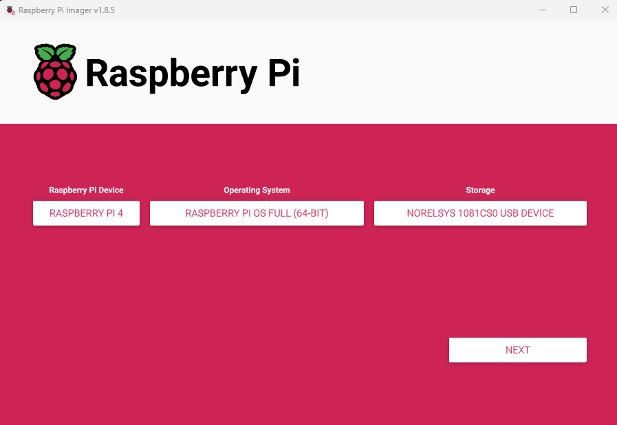
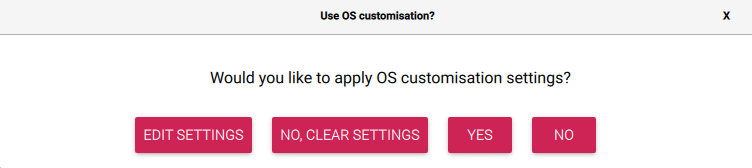
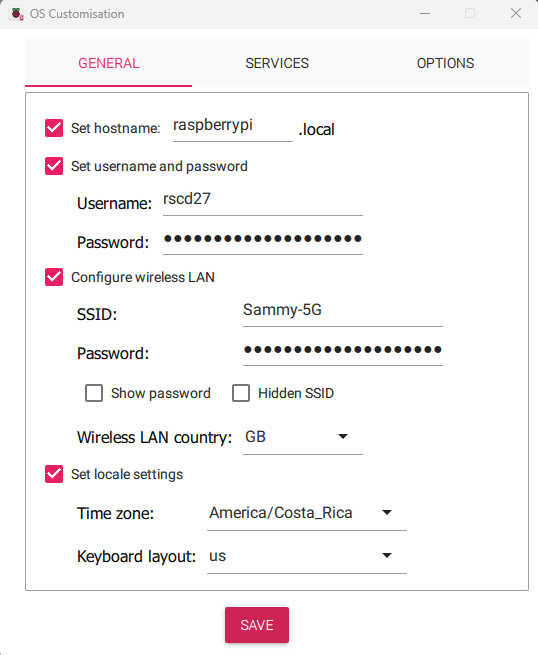
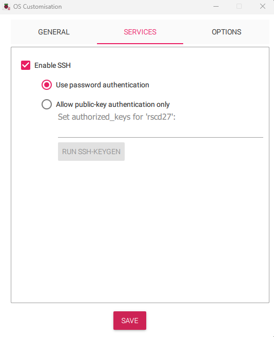
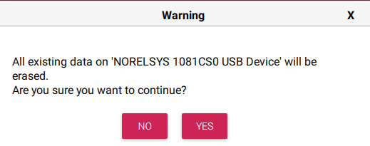

# Configurar RPI

Esta es la guía para realizar la configuración del RaspberryPI a utlilizar en el cruso de Validación de Sistemas Embebidos TSEV-008 que forma parte del programa de estudio del Técnico en Sistemas Embebidos de la Universidad Fidélitas. Esta guía es creada para un RaspberryPI Modelo B versión 2018, sin embargo, puede funcionar para otros modelos. 

**Fuente:** [RPI4B_Product_page](https://www.raspberrypi.com/products/raspberry-pi-4-model-b/) 

## Instalación de RaspberryPI OS 

### En caso de usar Windows

1 - Como primer paso se debe de descargar la aplicación **Raspberry Pi Imager** del siguiente [RaspberryPI Software](https://www.raspberrypi.com/software/). Por favor ir a la sección llamada **Install Raspberry Pi OS using Raspberry Pi Imager** (Instalar Raspberry Pi OS utilizando el Imaginardor de Raspberry Pi).

2 - En la sección de Raspberry Pi Device (Dispositivo Raspberry Pi en español), de click en **CHOOSE DEVICE** (Escoger Dispositivo en español). Seleccione la versión de su dispositivo, por ejemplo, para el RPI4 Modelo B seleccione **RASPBERRY PI 4**.

3 - En la sección Operating System (Sistema Operativo en español), de click en **CHOOSE OS** (Escoja OS en español). Acá debe de hacer scroll down y navegar hasta la sección **Raspberry Pi OS (other)** y debe de escoger la versión **Raspberry Pi OS Full (64-bit)**.

4 - En la sección de Storage (Almacenaje en español) de click en **CHOOSE STORAGE** (Escoja Almacenamiento en español) y escoja el nombre de su Tarjeta SD. Deberia de verse como la siguiente imagen:

5 - Dar click en **NEXT** (Siguiente en español).

6 - En la ventana emergente llamada **Use customisation OS** (Usar personalización de OS en español), de click en la opción de **EDIT SETTINGS** (Editar Configuración en español).

Se recomienda una configuración similar a esta, sin embargo debe de poner su propio usuario y contraseña, y su propia red de WI-FI. También puede cambiar el tipo de teclado. 

7 - De click en **Save** (Guardar en español). 

8 - De click en **Yes**  y luego **Yes** otra vez en la ventana de advertencia que le indica que todos los contenidos de la Tarjeta SD van a ser borrados. 

.

9 - Una vez que termine el proceso, expulse la Tarjeta de SD de Windows para evitar que se corronpan los datos a la hora de extraerla. Extraigala e insertela en su dispositivo Raspberry PI mientras este se encuentre apagado, por último proceda e encenderlo.

Este es el repositorio de la Máquina de café para el curso de Validación de Sistemas Embebidos TSEV-008 del programa de Técnico en Sistemas Embebidos de la Universidad Fidélitas.
