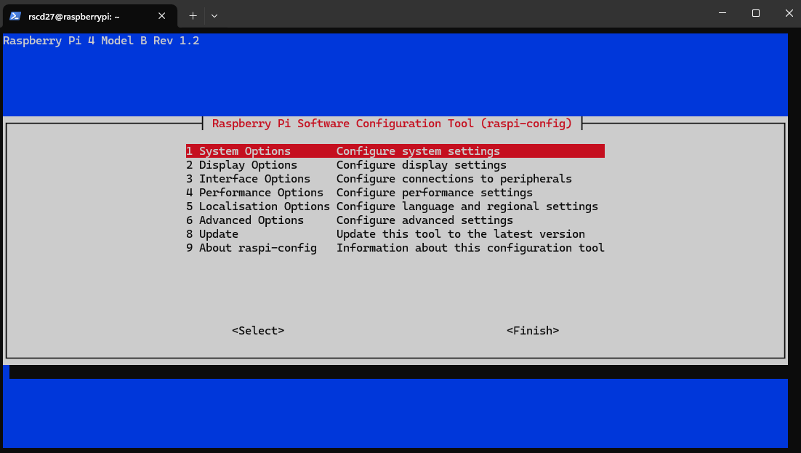
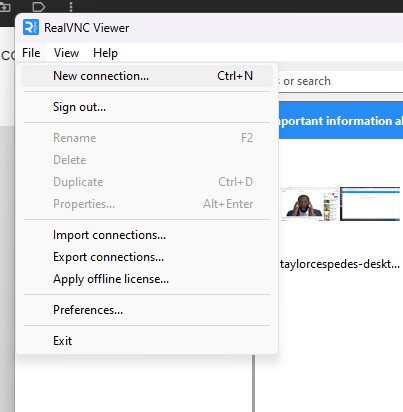
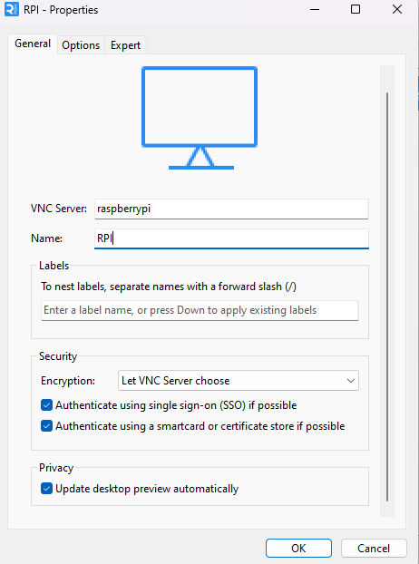
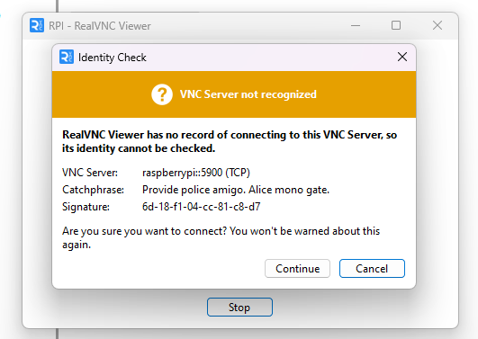
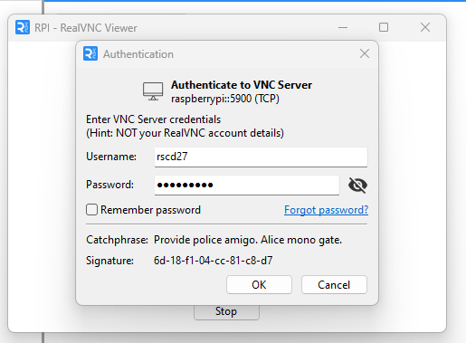
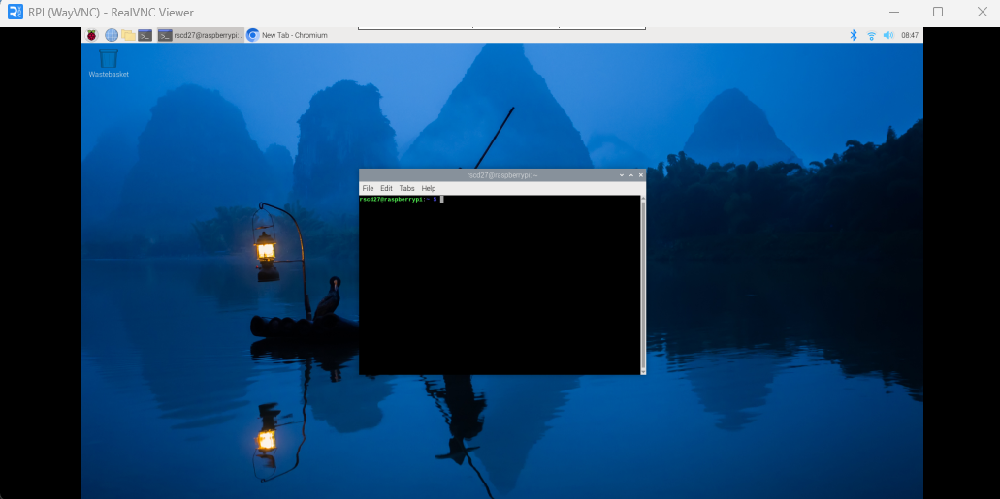

# Real VNC

**Nota:** Se recomienda utilizar un programa de Remote desktop como RealVNC. Este se puede instalar con este comando:

```
~S sudo apt install realvnc-vnc-server realvnc-vnc-viewer
~S sudo raspi-config
```

Vera la siguiente ventana:



Usando las flechas navegue a  ‘Interfacing Options’ > ‘VNC’ y seleccione 'Yes'.

Vera el siguiente mensaje: **The VNC Server is enabled**, luego seleccione **Finish**.

Instale Real VNC Viewer, que puede descargar de este [link](https://www.realvnc.com/en/connect/download/viewer/windows/?lai_sr=0-4&lai_sl=l). Siga las instrucciones y proceda a crear una cuenta. Después de ingresar a su cuenta. Puede crear una nueva conexión en 'File'>'New Connection'.





De click en la nueva conexión llamada **RPI**.


Presione **Continue** en la ventana emergente.



Ingrese su usuario y contraseña del RPI.



Finalmente podra ver su escritorio de RPI desde Windows.


