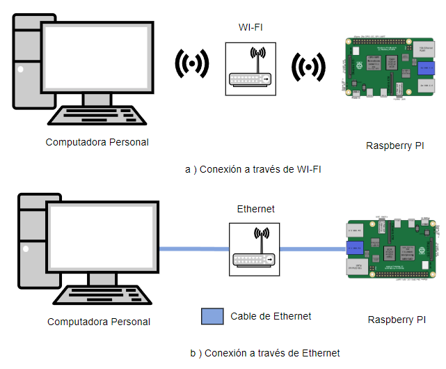
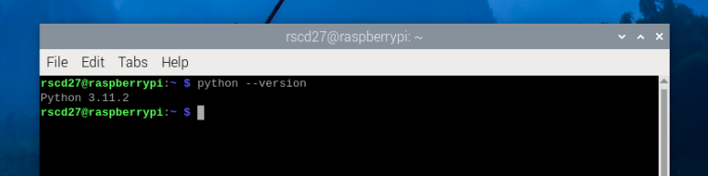
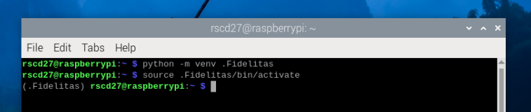

# Maquina_de_Cafe
Este es el repositorio de la Máquina de café para el curso de Validación de Sistemas Embebidos TSEV-008 del programa de Técnico en Sistemas Embebidos de la Universidad Fidélitas.

## Configuración de Raspberry PI 

Para configuirar el Raspberry PI o **RPI** [Forma en la que nos vamos a referir al dispositivo embebido en esta guía], por favor seguir las instrucciones en [Configurar_RPI](./Documentos/Configurar_RPI.md).


## Instalación de Software en Raspberry PI 

Una vez instalado RPI OS, se puede proceder a instalar el software necesario para poder correr el código de la Máquina de Café. Para esto puede ingresar de forma directa al RPI por medio del uso de un monitor, teclado y mouse. También se puede conectar por medio de SSH (del inglés Secure Shell o Consola Segura). Se tiene que tener en cuenta de que existen multiples formas de conectarse, todo dependera de que tan comodo se sienta utilizando la consola. Para esta guía se dara un acercamiento mixto. 

1. Existen varias formas de conectarse al dispositivo como se ven la siguiente figura. 



#### Uso de Consolas en Windows y en RPI

En el caso de la consola que corre en la computadora personal de Windows va a ser identificada de la siguiente forma:

```
C:\ <Comando> --parametro-1 --parametro-2
```
La consola en el RPI se identifica como:

```
~S <Comando> --parametro-1 --parametro-2
```

2. En caso de haber seguido la guía [Configurar_RPI](./Documentos/Configurar_RPI.md). Se tiene habilitado el SSH y se configuro a su vez el hostname del dispositivo, como se ven la siguiente figura.


Para verificar que el RPI esta presente debe de estar conectado a la misma red de WI-FI o al mismo switch de ethernet, puede ejectur el siguiente comando:

```
C:\ ping raspberry
```

En caso de encontrar el dispositivo se vera un mensaje como este:

```
Pinging raspberrypi.local [fe80::eaad:c0e9:6057:550a%18] with 32 bytes of data:
Reply from fe80::eaad:c0e9:6057:550a%18: time=99ms
Reply from fe80::eaad:c0e9:6057:550a%18: time=8ms
Reply from fe80::eaad:c0e9:6057:550a%18: time=8ms
Reply from fe80::eaad:c0e9:6057:550a%18: time=8ms

Ping statistics for fe80::eaad:c0e9:6057:550a%18:
    Packets: Sent = 4, Received = 4, Lost = 0 (0% loss),
Approximate round trip times in milli-seconds:
    Minimum = 8ms, Maximum = 99ms, Average = 30ms
```

En caso de no encontrar el dispositivo se vera un mensaje como este:
```
Ping request could not find host raspberrypi. Please check the name and try again.
```

En caso de no encontrarlo desde la computadora personal, puede conectar el monitor, teclado y mouse y correr los siguientes comandos:

```
~S hostname
```

**Nota:** Este devolvera el nombre del dispositivo en caso de que no lo haya configurado como **raspberry**.


```
~S ifconfig
```
**Nota:** El RPI tiene 3 redes, pero las de interés para nostros son **eth0** [conexión de ethernet] o **wlan0** [conexión WI-FI].

3. Una vez que tenga el **hostname** o la **ip** del RPI puede hacer una conexión SSH en caso de que la haya habilitado. Sino debe de habilitarla al conectarse directamente al RPI de forma manual.

```
C:\ ssh <nombre_de_usuario>@<hostname o IP>
```

Por ejemplo,

```
C:\ ssh rscd27@raspberrypi
```

En caso exitoso se vera el siguiente mensaje:

```
The authenticity of host 'raspberrypi (fe80::eaad:c0e9:6057:550a%18)' can't be established.
ED25519 key fingerprint is SHA256:e8ifI1tnI9Cl+jrcP65RHbmbbwqLC2TuHZdYgR4lTco.
This key is not known by any other names
Are you sure you want to continue connecting (yes/no/[fingerprint])?
```

Escriba **yes** y presione enter, esto solo se tendra que hacer una vez, luego le va a preguntar la contraseña. **Importante:** Como medida de seguridad Debian no muestra los caracteres con "*" por lo que puede parecer que no se está escribiendo nada. Sin embargo, si se esta escribiendo, cuando ingrese la contraseña presione enter.

```
Warning: Permanently added 'raspberrypi' (ED25519) to the list of known hosts.
rscd27@raspberrypi's password:
```

En caso de conexión exitosa vera el siguiente mensaje:

```
Linux raspberrypi 6.6.20+rpt-rpi-v8 #1 SMP PREEMPT Debian 1:6.6.20-1+rpt1 (2024-03-07) aarch64

The programs included with the Debian GNU/Linux system are free software;
the exact distribution terms for each program are described in the
individual files in /usr/share/doc/*/copyright.

Debian GNU/Linux comes with ABSOLUTELY NO WARRANTY, to the extent
permitted by applicable law.
Last login: Wed Jun  5 09:06:08 2024
```

4. Una vez conectado por ssh o de forma directa manual. Actualize el software en el RPI con los comandos: 

```
~S sudo apt update
~S sudo apt upgrade
```

**Importante:** de esta forma puede correr comandos en el RPI desde su computadora con Windows.

### Opcional Pueden usar RealVNC para poder evitar usar un monitor en el RPI, sin embargo, si lo desea puede omitir esta parte y conectarse directamente de forma manual.

Pueden ver el manual acá [Guía para instalar Real VNC](./Documentos/RealVNC.md).

5. Verifique su versión de Python

```
~S python --verison
```

Obtendra un mensae de este tipo.



**Nota:** Se recomienda una versión mayor a 3.11.2

6. Configure venv

Raspbeery PI OS viene con un ambiente llamado **venv** que permite tener diferentes ambientes de Python con diferentes bibliotecas. Vamos a crear un ambiente llamado Fidelitas

```
~S python -m venv .Fidelitas
~S source .Fidelitas/bin/activate
```

Se vera de la siguiente forma.



El **(.Fidelitas)** antes de **rscd27@raspberrypi** nos deja saber que estamos en el ambiente Fidelitas.

**Nota:** Se puede desactivar el ambiente de la siguiente forma. 

```
(.Fidelitas) ~S deactivate
```
7. Instale las siguientes bibliotecas.


```
(.Fidelitas) ~S python -m pip install scalene numpy
```
